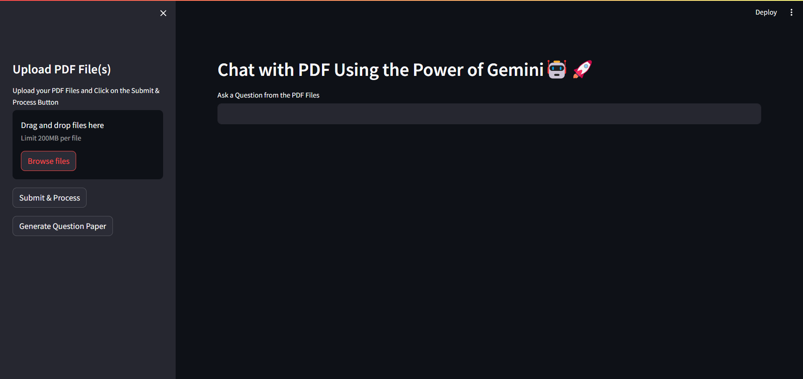

# DocuMentor

DocuMentor is a Streamlit application that allows users to chat with multiple PDF files and generate questions based on the content of the PDF files. Users can also download the generated questions as a PDF file.

## Features

- Upload multiple PDF files.
- Extract text from the PDFs.
- Generate questions based on the content of the PDFs.
- Chat with the PDFs using natural language.
- Download the generated questions as a PDF file.

## Screenshot of the Interface



## Installation

To run this application locally, follow these steps:

1. Clone the repository:
    ```bash
    git clone https://github.com/your-username/DocuMentor.git
    ```
2. Navigate to the project directory:
    ```bash
    cd DocuMentor
    ```
3. Create a virtual environment and activate it:
    ```bash
    python -m venv venv
    source venv/bin/activate  # On Windows, use `venv\Scripts\activate`
    ```
4. Install the required dependencies:
    ```bash
    pip install -r requirements.txt
    ```
5. Add your Gemini API key to the `.env` file:
    ```env
    GOOGLE_API_KEY=YOUR_GEMINI_API_KEY
    ```
6. Run the Streamlit application:
    ```bash
    streamlit run app.py
    ```

## Usage

- Open the Streamlit application in your browser.
- Upload one or more PDF files using the sidebar.
- Ask questions related to the content of the PDF files.
- Generate a list of questions based on the PDF content.
- Download the generated questions as a PDF file.

## License

This project is licensed under the MIT License. See the [LICENSE](LICENSE) file for details.

## Contributing

Contributions are welcome! Please open an issue or submit a pull request for any changes.

## Acknowledgements

- [Streamlit](https://streamlit.io/)
- [PyPDF2](https://pypi.org/project/PyPDF2/)
- [LangChain](https://github.com/langchain/langchain)
- [ReportLab](https://www.reportlab.com/)
